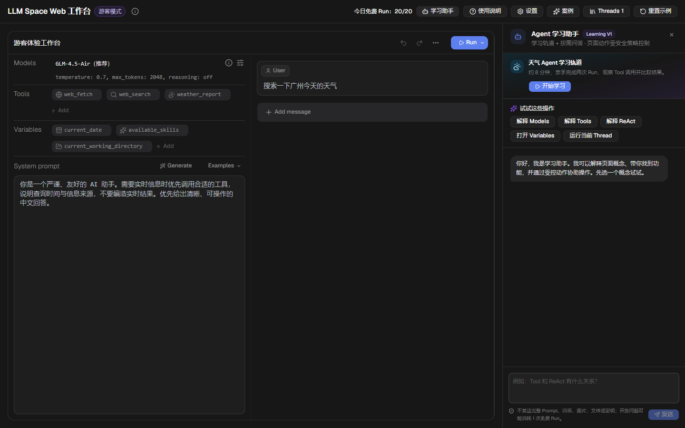

[English](./README.md) | 中文

[](https://github.com/VikiChan2021/llm-space-web/actions/workflows/ci.yml)
[](./package.json)
[](./mise.toml)
[](./LICENSE)

# LLM Space Web

一个可直接在浏览器中构建、运行、追踪、调试和对比 AI Agent 的交互式学习工作台。

**在线体验：** [https://kandian.site/llm-space-web/#/workbench](https://kandian.site/llm-space-web/#/workbench)



## 可以体验什么

- 从 9 个可编辑 Agent 案例开始，包括实时天气、Deep Research、General Agent、Translation 和 Deep Wiki。
- 在同一个工作台中调整模型、Prompt、消息、Variables、Tools、MCP 与 ReAct 设置。
- 使用受控的浏览器/服务端工具运行 Agent，并实时查看流式模型输出。
- 查看 Run history 与 Trace，对比两次执行、恢复快照并记录人工评估。
- 使用 Agentic AI 学习助手解释当前界面、完成天气 Agent 学习轨道，并通过已注册且带确认边界的页面动作协助操作。
- 将游客 Thread 保存在当前浏览器，并通过 JSON 导入、导出。

## Hosted Alpha 边界

本仓库目前展示的是 Web Hosted Alpha，不宣称已经达到生产级多租户 SaaS。

- 游客 Thread 与虚拟文件保存在当前浏览器。
- 免费模型调用有每日额度；模型供应商密钥只保存在服务端。
- 仅开放白名单模型与受控工具。
- 游客模式不开放宿主 Bash、宿主文件系统、任意 DOM/JavaScript 控制、公共远程 MCP、登录、BYOK、账单或跨设备 Thread 同步。

当前使用方法见产品内的 [Web 快速开始](https://kandian.site/llm-space-web/#/docs/quick-start)。

## 本地开发

项目使用 [mise](https://mise.jdx.dev) 作为任务入口，使用 [Bun](https://bun.com) 作为包管理器和运行时。请勿使用 npm、pnpm 或 yarn 安装工作区依赖。

```bash
mise run setup
mise run dev:guest-web
```

游客 Web 工作台默认运行在 `http://localhost:15175/llm-space-web/`。

常用检查命令：

```bash
mise run check:changed
mise run build:guest-web
mise run pack:guest-api
```

## Web 架构

```text
apps/
  web/       # React/Vite 工作台、说明文档、案例与浏览器持久化
  cloud/     # 游客 HTTP/SSE API、模型额度、Coach 与安全工具执行
packages/
  core/      # 浏览器安全的 Agent/Thread 领域逻辑与服务端存储基础
  ui/        # 共享 Thread Playground 与设计系统
  runtime/   # 模型、工具、MCP 与 Agent 运行时实现
```

Web UI 与游客 API 分别构建，并在腾讯云部署中通过同源地址提供。供应商密钥不会进入浏览器 bundle 或 localStorage。

## 项目来源

本仓库是 [deer-flow/llm-space](https://github.com/deer-flow/llm-space) 的 Web 方向 Fork。上游项目是 Electrobun 原生桌面应用；本 Fork 为兼容性继续保留共享包与桌面源码，但 GitHub 首页、README 和线上产品均以浏览器工作台为展示重点。

## 许可证

项目采用 [MIT License](./LICENSE)。
