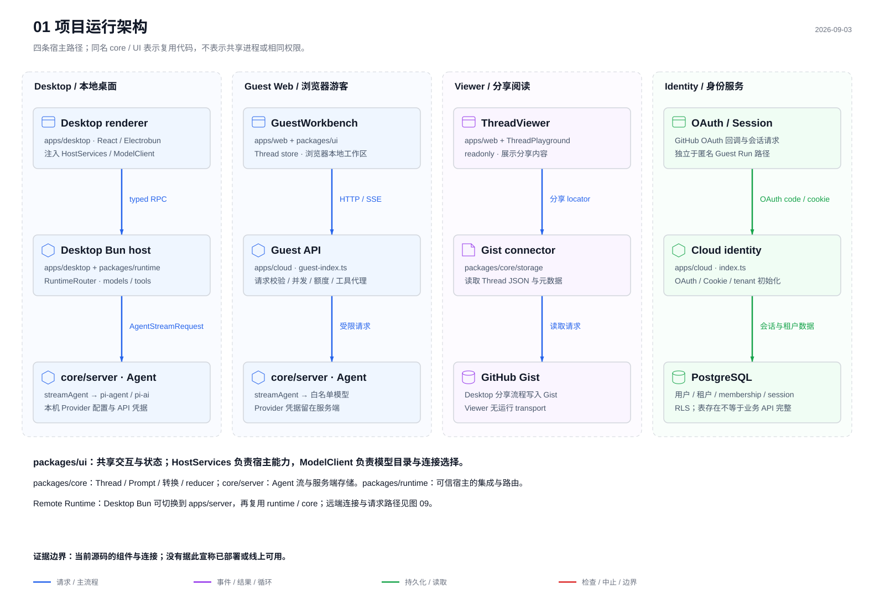

# LLM Space 架构阅读图册

这套图册用于回答三个问题：代码放在哪里、一次操作怎样穿过系统、数据与权限属于哪个宿主。图表使用 **fireworks-tech-graph / Flat Icon** 风格，依据 2026-09-03 当前工作树源码绘制，HEAD 基准为 `c5fd749c4ec3d0d1e0d073a635ee361928d1646c`。

**推荐入口：[离线图册 index.html](index.html)**。可直接用桌面浏览器打开，按主题切图、缩放、横向滚动，并展开源码入口。图表全部内嵌，无需启动 LLM Space、登录或调用模型；源码、SVG、PNG 链接依赖本目录的相对位置。浏览器自动化对本地文件 URL 的限制及验证范围见 [VERIFICATION.md](VERIFICATION.md)。

静态阅读可直接使用下表的 SVG，或阅读本文的解释。PNG 位于 `png/`，以 SVG 的两倍尺寸输出，适合插入文档或幻灯片。完整的源码路径、定位符、行号在 [SOURCES.md](SOURCES.md)；可机器检查的 SHA-256 指纹在 [sources.json](sources.json)。

## 建议阅读顺序

第一次阅读：**01 → 06 → 02 → 04 → 05**。先知道四种宿主的边界，再理解一次 Run、工具循环和保存过程。之后按兴趣阅读 Guest 数据流、评测、导出与远端运行。

| 图表 | 回答的问题 | 文件 |
| --- | --- | --- |
| 01 项目运行架构 | Desktop、Guest、Viewer、Identity 分别由谁承载？共享哪些代码？ | [SVG](svg/01-system-architecture.svg) · [PNG](png/01-system-architecture.png) |
| 02 Desktop Run 时序 | 点击 Run 后，请求与事件经过哪些函数和进程？ | [SVG](svg/02-desktop-run-sequence.svg) · [PNG](png/02-desktop-run-sequence.png) |
| 03 Guest 数据流 | Prompt、模型结果、工具请求和额度数据各去哪里？ | [SVG](svg/03-guest-data-flow.svg) · [PNG](png/03-guest-data-flow.png) |
| 04 工具与 ReAct 循环 | 谁执行工具？谁决定再次调用模型？何时暂停？ | [SVG](svg/04-tool-loop.svg) · [PNG](png/04-tool-loop.png) |
| 05 数据持久化 | Thread、Undo、运行快照、Trace、localStorage 有何区别？ | [SVG](svg/05-persistence.svg) · [PNG](png/05-persistence.png) |
| 06 宿主能力矩阵 | 相同 UI 为什么在不同环境里有不同权限？ | [SVG](svg/06-capability-matrix.svg) · [PNG](png/06-capability-matrix.png) |
| 07 Evaluation Lab V2 | 实验怎样比较、审阅并应用 Candidate？ | [SVG](svg/07-evaluation-loop.svg) · [PNG](png/07-evaluation-loop.png) |
| 08 Prompt 与导出 | 编辑态模板如何变成模型请求及 Python 项目？ | [SVG](svg/08-prompt-and-export.svg) · [PNG](png/08-prompt-and-export.png) |
| 09 Remote Runtime | SSH、Bearer、RPC、SSE 分别承担什么？ | [SVG](svg/09-remote-runtime.svg) · [PNG](png/09-remote-runtime.png) |

图例：蓝色表示请求或主流程，紫色表示事件、结果或循环，绿色表示持久化或读取，红色表示检查、中止或能力边界。每条业务箭头都标明含义；虚线框表示分组或归属，不表示自动同步。时序图的竖向虚线表示参与者随时间持续存在。

## 01：先把仓库看成“共享语义 + 不同宿主”



仓库是 Bun workspace monorepo，共有四个应用工作区和三个共享包。应用决定启动入口与运行权限，共享包复用模型无关的领域语义、交互和运行能力。

| 工作区 | 主要职责 | 理解时需要守住的边界 |
| --- | --- | --- |
| `packages/core` | Thread、消息、模板、请求转换、reducer、历史和评测语义；显式 server 导出提供 Agent 与本地存储 | `core/server` 不能进入 renderer / web bundle |
| `packages/ui` | React 组件与 ThreadPlayground；每个实例的 Thread store | 通过 HostServices / ModelClient 使用宿主能力，不导入 Electrobun |
| `packages/runtime` | RuntimeClient、路由、模型连接、工具、MCP、Skills、Plugins、Trace | 在受信任的进程侧集成能力，不能直接当作 Guest 权限模型 |
| `apps/desktop` | React renderer、Electrobun RPC、Bun 组合根、原生动作和远端管理 | 进程内服务由 `start-desktop-app.ts` 组合；跨边界动作走 typed Command / RPC |
| `apps/server` | 无界面的 runtime HTTP 服务 | Bearer 鉴权、`/rpc`、`/stream` 和取消；执行宿主是远端机器 |
| `apps/web` | Landing、分享 Viewer、构建开关控制的 GuestWorkbench | Viewer 只读；Guest 使用浏览器状态和受限 API |
| `apps/cloud` | 身份/租户/会话入口，以及独立的 Guest API 入口 | 匿名 Guest 运行与 OAuth 身份服务不能混为一条链路 |

图 01 是运行归属图，不是全部 import 边的清单。Desktop 与 Guest 两列都出现 `core/server`，表示不同宿主复用同一段代码。右侧 PostgreSQL 包含租户与会话 schema，并不证明前端已经接通账号同步、团队工作区或所有数据 API。

## 02：沿一次运行追踪请求，再沿返回事件读回来

从 `ThreadTabPane` 注入 transport 开始，依次阅读 `thread-store.ts` 的 `run()`、`streamThread()`、`createRpcTransport()`、`forwardStreamThread()`、`LocalRuntimeClient`、`StreamThreadController.run()` 和 `streamAgent()`。

请求侧的关键变化是：**ThreadContext → 渲染后的 context → pi 格式上下文 → AgentStreamRequest**。模型连接引用与请求一起传递，但连接凭据由 Bun/远端宿主解析。返回侧的关键变化是：**Provider 输出 → AgentEvent → RPC event → reduceMessages → streamingMessage / 已提交消息**。

`runtimeId` 选择执行宿主；`streamId` 识别一次流，防止多个 Thread 的事件串线。`AbortSignal` 要沿 transport 传播到对应的运行控制器，不能只把页面按钮改回空闲。

阅读练习：在 `run()` 中找出 `preparing`、`running`、`finalizeActiveRun` 和 `sawEvent && !failed && !aborted`，解释为什么预检失败和中止不会生成普通成功运行快照。

## 03、06：Guest 的复用与限制同时存在

GuestWorkbench 复用共享 Thread store，但注入 `createGuestTransport` 和 `executeGuestTool`。每个模型回合向完整端点 **`/api/guest/runs`** 发送请求，服务端校验 Origin、输入大小、模型、工具、并发与 guest/IP 额度，再开始模型流。图 03 的 `POST /runs` 是该端点的简写。

浏览器 localStorage 保存工作区、偏好、虚拟文件与独立评测数据；Guest API 的额度存储保存 HMAC 身份摘要、日期和次数。Bun 入口使用 SQLite；仓库另有使用 JSON 计数存储的 Node 入口。此处只描述两种源码入口，不推断实际部署使用哪一个。

工具调用另走宿主能力：虚拟文件读写属于浏览器；Web/MCP 代理走受限服务端端点。工具列表中的 `bash` 入口返回边界说明，并不提供真实 Shell。普通 Guest ReAct 上限是 6 个模型回合和 8 次自动工具调用；模型回合会分别消耗额度。

读图自检：为什么浏览器内按钮可用仍不足以证明 API 会接受请求？为什么 Viewer 展示了工具定义，也不意味着访客能执行工具？

## 04：不要把全部 Agent 行为都归到 LLM 后端

服务端 `streamAgent` 把普通应用工具包装为 step-by-step 工具，交回终止信号；共享 UI 的 `executePendingToolCalls` 查找可执行工具，检查破坏性 Bash、宿主自动执行策略和调用数上限。通过检查后，Host 执行工具并将结果绑定回对应 toolCall。

| 运行模式 | 工具请求之后的行为 |
| --- | --- |
| `autoRunTools = false` | 停下，等待用户处理工具调用 |
| `autoRunTools = true`、`reactLoop = false` | 自动执行本轮工具，然后停下 |
| `reactLoop = true` | 将工具结果放入上下文，再次请求模型；受回合/调用数与停止条件限制 |

同一批已批准工具通过 `Promise.all` 执行；评测批次中的各个 Run 则按顺序执行。这是两个不同层次的并发。`function` stub 需要补充结果；provider-hosted native tools 在供应商侧执行，不经过应用的 Host 工具执行器。

## 05：区分内容、历史和证据

用户编辑的 Thread 放在 `workspace/`；完整运行快照放在 `history/`，Thread 中的 `runHistoryIndex` 持有轻量引用。`changeHistory` 是 Undo/Redo 的内存编辑历史，不能把它等同于持久化 Run history。

`LocalFileSystem.write` 会规范化并外置历史，做 schema 校验与原子文件写入，再清理未引用的快照。复制或移动 Thread 时，需要一起复制或重键历史。删除 Thread 后历史有意保留；维护任务从首次发现孤儿时记录时间，超过 30 天才回收。图中的 `snapshotRef` 箭头表示引用关系，不表示 workspace 文件自己执行了写盘。

Guest 的普通 Thread 和评测实验使用不同 localStorage key。实验为了比较和排错保留失败结果，这与普通运行不记录失败的成功快照策略并不冲突。Cloud PostgreSQL 与这些浏览器记录之间，当前图册没有画出账号同步通道。

## 07：当前源码已有 Evaluation Lab V2

不要把旧记录中的版本状态当作当前实现。当前 `evaluation-experiment.ts` 定义 `EVALUATION_LAB_VERSION = 2`，包含回归分类、应用计划、冲突判断与下一轮 lineage；GuestWorkbench 接入候选应用和先保存后更新 UI 的流程。

一次实验冻结源 Thread，创建 Baseline/Candidate，并选择测试 Cases。运行器为每项实验建立独立 Thread store，不把实验结果写入用户正在编辑的普通 Thread。每项最多 3 次模型回合、8 次自动工具调用；实验上限 10 个、每实验最多 50 Cases，默认选择 3 Cases 做一批。

运行后收集确定性 checks、工具名、token、耗时与人工评分，区分 improved、regressed、unchanged 和 unknown。应用前对比 `sourceThread` 与当前 Thread 的受控字段，存在冲突则拒绝；可应用范围包括模型 provider/id、temperature、maxTokens 和 systemPrompt。应用成功后建立带 lineage 的下一轮实验，继承 Cases，清空新一轮结果。

这些结论经过源码核对；本次工作没有调用模型、运行评测批次或验证线上 V2。UI 的“应用成功”不能描述为跨两个 localStorage key 的数据库事务。

## 08：模板、快照与导出项目是三种产物

编辑态 Thread 保留模板。`renderThreadPromptVariables` 解析变量并通过宿主加载 Skills/文件，得到渲染上下文和冻结快照；`streamThread` 再转换为 Agent 请求。快照帮助回答“当时使用了什么输入”，不是把当前变量重新求值一遍。

LangGraph 导出是独立功能：Desktop 宿主提供写文件能力，生成器确定性地产生 Python/uv 项目、模型装配、变量语义、受支持的 built-in 工具与 MCP 配置，并导出 `references/`、`PLAN.md`。自定义 function 可能仍是 stub；Plugin 和 provider-hosted tools 会拒绝导出，未知 built-in 不会凭空得到实现。

修改 Prompt 的内置变量、函数、filter 或 macro，需要同时维护 TypeScript 与 Python 生成实现，并实际执行生成的 Python 验证行为一致性。本次仅添加图册，没有修改这些语义或执行生成项目。

## 09：远端执行不是另一套前端

Desktop 通过 RemoteServerManager 管理 SSH 或手工 HTTP 连接，RemoteRuntimeClient 使用 Bearer 请求 `/health`，验证协议、版本和能力，再由 RuntimeRouter 注册和选择 runtime。

运行时，`/rpc` 承载能力调用，`/stream` 承载 Agent 请求与 SSE 响应。远端 apps/server 复用 LocalRuntimeClient、StreamThreadController、core/server，使用远端自己的模型、工具和文件。返回事件转换成 Desktop RPC 事件，继续由共享 reducer 处理。

SSH 主机信任、HTTP Bearer、协议兼容性和工具能力是不同检查。`/health` 有响应不等于模型凭据正确；能运行模型也不等于某个工具或文件路径可用。

## 如何结合源码学习

1. 在离线图册中选择一个流程，读两条说明和自检问题。
2. 展开“对应源码与当前行号”，先找定位符，再追调用者和被调用者。部分本地浏览器不支持 `#L行号` 高亮，可按显示的行号或定位符在编辑器中搜索。
3. 用一段具体输入讲述经过每一条箭头时的数据形态，例如“一句用户消息怎样成为 AgentStreamRequest，再变回 assistant 消息”。
4. 加一个失败条件：模板错误、模型无效、工具待审、取消、额度不足、保存失败或版本不兼容。指出哪层停止、哪层显示结果。
5. 对照 [已有 codemap](../codemap/codemap.html) 做更细的节点探索；旧 codemap 的时间与证据应单独判断，本图册没有修改它。

## 文件与维护

```text
docs/architecture/
├── README.md              阅读顺序与机制解释
├── index.html             单文件离线图册，内嵌全部 SVG
├── svg/                   9 张可编辑矢量图
├── png/                   9 张双倍尺寸位图（派生输出，Git 忽略）
├── build-atlas.py          人工维护的语义、布局和图册生成器
├── SOURCES.md              按图分组的源码证据索引
├── sources.json            定位符、行号、SHA-256
├── validation.json         Fireworks 自动检查结果
└── VERIFICATION.md         本次验收的范围与限制
```

源码入口改名或内容变化后，先检查图中结论再更新生成器。仅重新画图不会自动纠正架构语义；核对后更新脚本中的 `DATE`、`COMMIT` 与说明，并重新验收。

在项目根目录运行（Python 需已安装；导出 PNG 需 CairoSVG 与中文字体）：

```powershell
# 只检查已记录的源码是否漂移，不覆盖图册。
mise exec -- python docs/architecture/build-atlas.py --check-sources

# 重新生成，并使用已安装技能的验证器进行完整检查。
mise exec -- python docs/architecture/build-atlas.py --skill-root "C:\Users\陈伟记\.agents\skills\fireworks-tech-graph"

# 不输出 PNG 时可跳过 CairoSVG；仍保留 SVG / HTML 与几何检查。
mise exec -- python docs/architecture/build-atlas.py --no-png --skill-root "C:\Users\陈伟记\.agents\skills\fireworks-tech-graph"
```

Windows 可用 `Start-Process -FilePath (Resolve-Path 'docs/architecture/index.html').Path` 在默认浏览器打开。该操作由使用者执行；图册自身不会启动服务器或访问外部服务。

维护时保留 SVG/HTML/生成器与源码索引，按需重新生成 PNG。普通截图、临时日志和预览进程数据不存入此目录。文档与运行事实以当前源码和各自验收证据为准，不从旧 Kaizen 日志推定部署状态。
