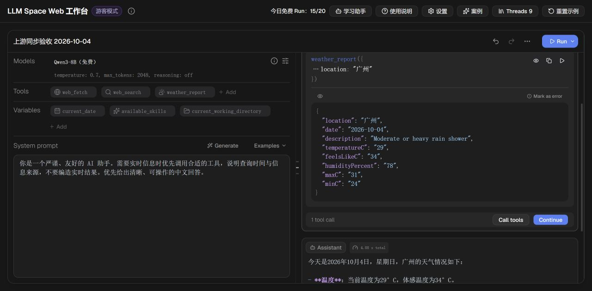
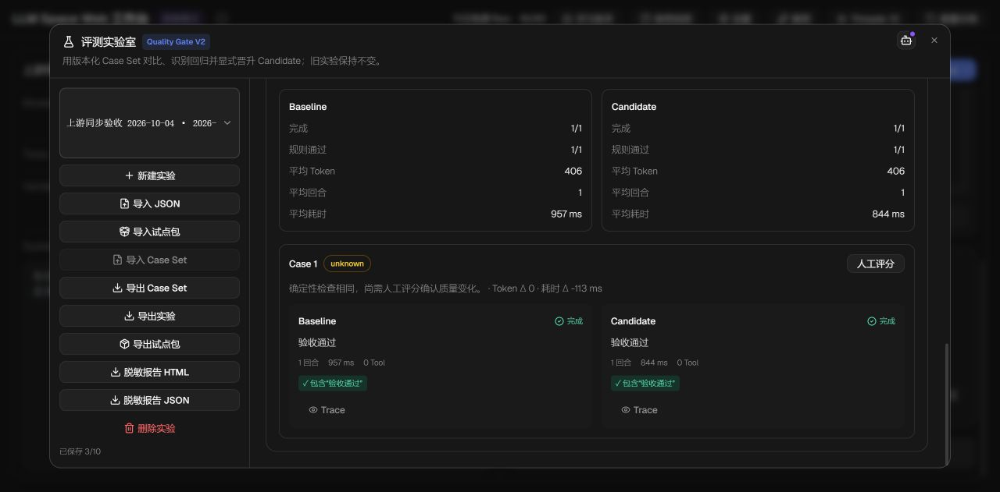
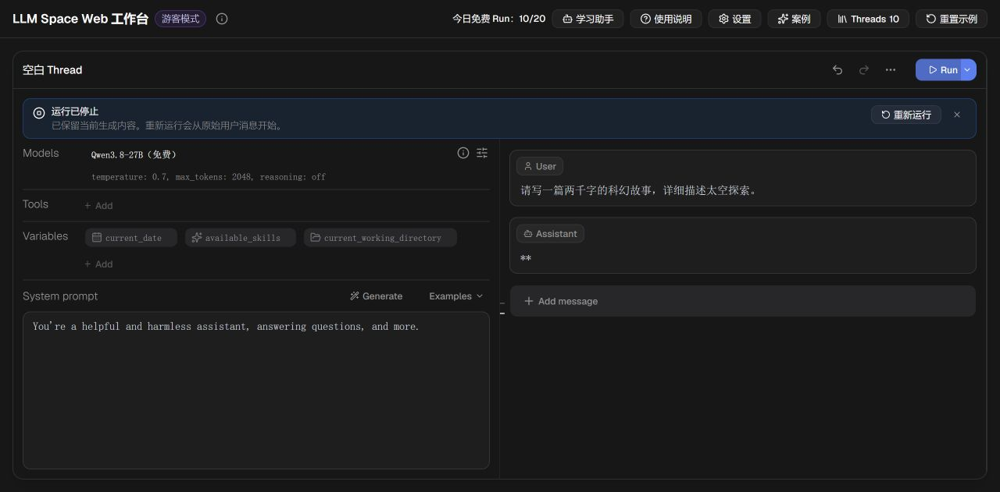
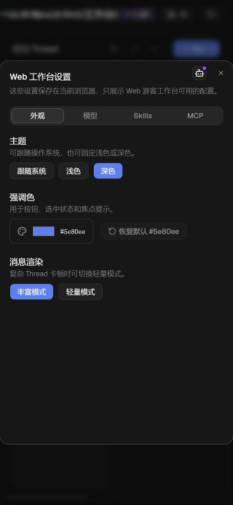

# 2026-10-04 上游同步与腾讯云验收

本次采用选择性回移，保留 fork 的免费模型、游客权限、学习助手、评测 V2 和试点包实现。没有整体合并上游，也没有升级 Pi、引入桌面特权或开放公共远程 MCP。

## 版本与发布

- Fork 同步前：`358a78a0ceba5e488393b0a414ffa50f75f6ee47`。
- 上游检查点：`777eb9ca7ec3cd9550395413394a0bb70dc26364`。
- 已发布代码：`4a52214ed8687a614c05430c01e81a3879a58954`。
- 线上入口：[LLM Space Web](https://kandian.site/llm-space-web/)。
- 腾讯云 release：`20261004-061436-4a52214ed868`，API 和静态页面链接均指向该版本，systemd 状态 `active`，健康检查成功。
- 上一版本保留：`20261004-041628-6b3eeb819161`。发布脚本保留失败回滚逻辑，未删除历史 release。
- API 包本地与服务器 SHA-256 一致：`2fefe220cdda5587f78162b086a2052546b5283a062bd02098df7cbf06c12c31`。

## 同步内容

以下 16 个提交通过 `cherry-pick -x` 保留来源记录：

| 上游提交 | 内容 |
| --- | --- |
| `344feb6`、`b3503c3`、`b403abb` | 流式消息和工具结果滚动稳定性 |
| `1d3342d` | 小窗口对话框操作按钮 |
| `4f29e77` | Windows 开发说明 |
| `69349e1`、`084697b`、`c762884`、`d6e9853` | 虚拟列表、滚动位置、缩放和滚动条样式 |
| `ef9a804`、`3795a54` | Bash、grep、glob 输出上限及 UTF-8 边界 |
| `41869c1`、`a2734e6` | 文件系统路径约束和递归复制符号链接检查 |
| `b0f9f59` | 导入 Thread 时保留工具错误状态 |
| `5e86bc8` | edit 工具按字面量写入 `$` 等替换字符 |
| `63a03d3` | Run 历史记录解析后实际使用的模型 |

另适配 `6e7d9e4`、`6e13d27`、`b02ea34`、`df0ae59` 涉及的提示变量逻辑：日期和 Skills 在新渲染中更新，递归 include 共享一次变量解析，工作目录支持可选路径解析，保留旧快照兼容性。新增测试实际执行生成的 Python，验证嵌套 include 的 system/meta 日期刷新。

验收中还修复了现有测试的 Select mock 缺少导出、Windows CRLF 生成清单比较，以及 lint 扫入本地浏览器产物的问题。CI 安装生成器测试需要的 Jinja2 3.1.6。

## 自动化验证

- [发布代码 CI](https://github.com/VikiChan2021/llm-space-web/actions/runs/37182167067)：**953 pass、1 skip、0 fail**，171 个测试文件，2612 个断言；完整 lint、类型检查、桌面 renderer 构建和 Web 构建均通过。
- 本地 `mise run lint`、`mise run typecheck`、`mise run build:guest-web`、`mise run pack:guest-api` 成功。
- 定向验证：301 项核心/游客/消息/历史测试通过；54 项兼容与文件路径测试通过；Python 日期与生成清单的 5 项检查通过。这些集合存在重叠，不应相加作为总数。
- Windows 首轮完整测试因 `/bin/sh`、WSL Bash、`python3`、POSIX 权限和符号链接条件失败；未将这些测试跳过来取得绿色结果。完整跨平台结论依据 Ubuntu CI。

## 线上浏览器与 API 验证

| 范围 | 结果 |
| --- | --- |
| 模型 | Qwen3-8B、OpenRouter 免费自动路由、Qwen3.8-27B 三个可选模型均真实请求并返回最终文本 |
| 天气 Agent | 启用 ReAct 后自动调用 weather_report，继续生成包含 2026-10-04 日期、温度和建议的回答；消耗按模型回合计数 |
| 运行记录 | 新记录显示 siliconflow/Qwen/Qwen3-8B；刷新后 Thread、Run、对比评测仍保留；旧记录也仍可读取 |
| Run 对比 | 展开历史面板后选取两个 Run，比较弹窗可用，保存 Run B Better 和备注成功 |
| 评测实验室 | 新建独立实验，1 Case × Baseline/Candidate 完成 2/2，两侧规则 1/1 通过；重开后结果保留。质量变化按证据显示 unknown，没有伪造改进结论 |
| 停止运行 | 真实长文本请求可停止，恢复可编辑状态，显示“运行已停止”并保留部分输出 |
| 学习助手 | 提问后可正常返回说明，恢复输入状态；界面操作指引的精确性见下面的验证边界 |
| 小屏 | 390×844 设置弹窗宽度/scrollWidth 均为 390，关闭按钮及 Skills/MCP 页签可达；随后恢复原始窗口尺寸 |
| 权限 | 跨站请求 403 origin_mismatch；付费/伪造模型 400 guest_model_unavailable；公共远程 MCP 403 remote_mcp_disabled |
| 输入错误 | 无效 JSON、空消息、错误最后消息角色、MCP 除零均返回预期错误码 |
| 真实工具 | 内置 MCP 工具发现与 calculator、web_fetch Example Domain、weather_report 广州均成功；发布探针另验证 web_search |
| 浏览器错误 | 线上专用标签页的 error/warn 为空；刷新资源与 API 记录无 4xx/5xx 或 loadingFailed，见 network.json |

运行开关已恢复验收前的关闭状态。验收创建了独立 Thread 和实验，没有删除原有用户内容。

## 验证边界

- **文件导入浏览器验收未完成**：Chrome 扩展明确要求开启“允许访问文件网址”，当前未授权扩大扩展访问权限，因此保持原设置。导入、迁移、错误保留、试点包和导出脱敏逻辑已通过自动化测试。
- 报告下载按钮已尝试，但浏览器 download 事件超时，未取得下载文件，不能声明线上导出文件内容验收通过。
- 学习助手对 Run History 的入口描述偏泛化，实际入口是 `More actions → View Run History`。问答链路成功不代表每条自然语言指引都准确。
- 本次发布的是 Web/Guest API；没有发布桌面二进制，CEF/macOS 实机行为没有本次生产验收证据。
- GitHub Pages 工作流因仓库未配置 Pages 而失败，与本次腾讯云发布独立；未更改 Pages 配置。
- 免费模型此次均成功，但供应商限流和未来可用性不属于永久保证。

## 证据

[脱敏网络状态](network.json)仅保留 URL、状态和网络错误，不包含请求头、Cookie 或模型输入输出。
